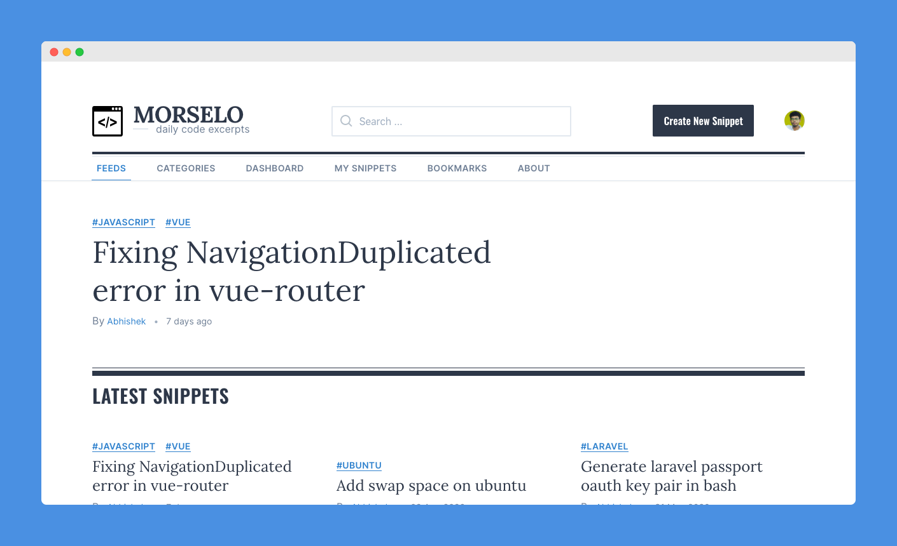

# Morselo - the daily code excerpt

## Hello Dev!

Often searching for your valuable snippets or reusable functions in your previous projects is fraustating right? Sometimes it takes lot of times and efforts to find so. 😤 Wait ...

Morselo is a place you might be looking for. This is a platform where you could easily manage your snippets, code or notes without any hassle. Let the burden of managing and organising your snippet to Morselo, so that you could concentrate more on your productivity.

## The app

**This app consist of two parts:**

### Frontend

The frontend is built with `vuejs`, `tailwindcss` and `apollo-graphql` package.

Code is available at
[Morselo-client](https://github.com/team-underground/morselo-client)

### Backend

The backend is built with `Laravel`, `laravel-lighthouse` and `lighhouse-passport-auth` package.

Code is available at
[Morselo-server](https://github.com/team-underground/morselo-server)

## Installatioin and Usage

installation and usage guide is available for both projects on their respective readme.

## Contributing

coming soon...

## License

Morselo is open-sourced software licensed under the [MIT license](https://opensource.org/licenses/MIT).
